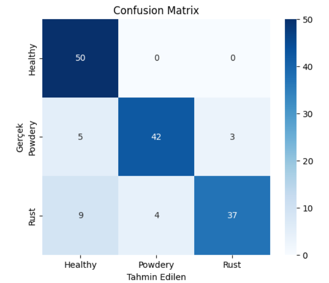

# GlobalAIbootcamp
# 🌱 Plant Disease Classification with Transfer Learning (VGG16)

## 📌 Proje Hakkında
Bu proje, yapay zeka tabanlı **bitki hastalıkları sınıflandırması** yapmayı amaçlamaktadır. Hepimizin hobi amaçlı küçük bahçelerde tarım girişimlerimiz bulunmaktadır. Bu girişimlerimizde başarıya ulaşmak adına hobi çiftçilerine yardımcı olmak amaçlanmıştır. 
Kullanılan veri seti üç sınıfa ayrılmıştır:
- **Healthy** (sağlıklı yapraklar)
- **Powdery** (külleme hastalığı)
- **Rust** (pas hastalığı)

Amaç, yaprak görüntülerini doğru şekilde sınıflandırarak tarımda erken teşhis ederek hastalıkların yayılmasını önlemek, ürün verimliliğini artırmaktır.

---

## 📂 Veri Seti
- Kaynak: [Kaggle Plant Disease Recognition Dataset](https://www.kaggle.com/)  
- Eğitim seti: **1322 görüntü**
- Doğrulama seti: **60 görüntü**
- Test seti: **150 görüntü**
- Toplam sınıf sayısı: **3**

---

## 🧠 Yöntem
- **Transfer Learning**: VGG16 tabanlı model
- **İlk Aşama**: Sadece dense katmanlar eğitildi
- **İkinci Aşama (Fine-Tuning)**: VGG16’nın son (Block5) katmanları açılarak tekrar eğitildi
- **Veri Ön İşleme**:
  - Görseller 128x128 piksel boyutuna getirildi
  - Data Augmentation (rotation, shift, zoom, flip)

---

## 📊 Sonuçlar

### Doğruluk
- Eğitim doğruluğu (fine-tuning sonrası): **%91.1**
- Doğrulama doğruluğu: **%88.3**
- Test doğruluğu: **%86**

### Classification Report (Test Seti)

| Class    | Precision | Recall | F1-score |
|----------|-----------|--------|----------|
| Healthy  | 0.78      | 1.00   | 0.88     |
| Powdery  | 0.91      | 0.84   | 0.87     |
| Rust     | 0.93      | 0.74   | 0.82     |
| **Avg**  | **0.87**  | **0.86** | **0.86** |

### 📈 Grafikleri Temsil Eden Sonuçlar
- Accuracy eğrisi eğitim ilerledikçe artarak **%91**’e ulaştı.
- Validation accuracy, ilk başta %56 iken fine-tuning sonrası **%88.3** seviyesine çıktı.  
- Loss eğrileri düşüş göstererek stabil hale geldi (final val_loss ≈ 0.37).
- 
- Confusion Matrix sonuçları sınıflar arasında dengeli bir başarı gösterdi.
- 

---

## 🚀 Gelecek Çalışmalar
- Daha büyük ve dengeli veri setleri ile eğitim
- Farklı transfer learning modellerinin (ResNet, EfficientNet) denenmesi
- Hiperparametre optimizasyonu
- Mobil uygulamaya entegrasyon

---

## Linkler
https://www.kaggle.com/code/fakkor/bitkiler

## 👤 Yazar
Bu proje **[Fatih Akkor]** tarafından hazırlanmıştır.  
